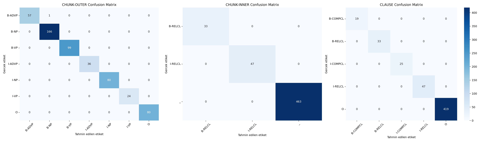
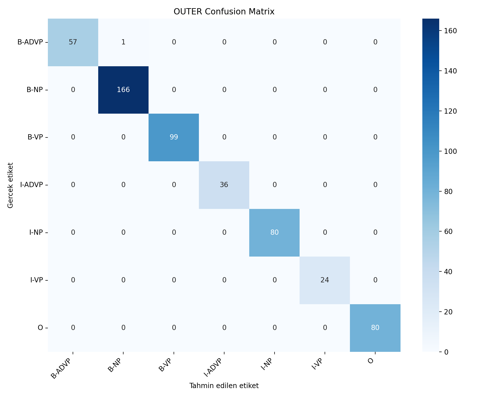
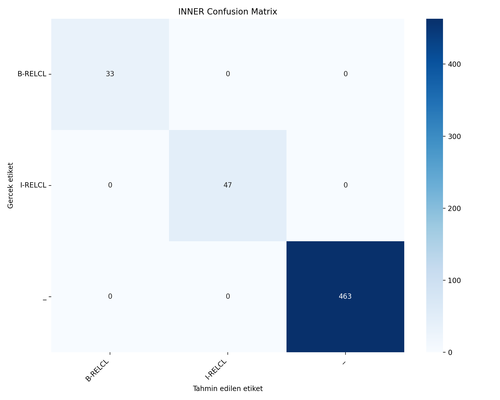
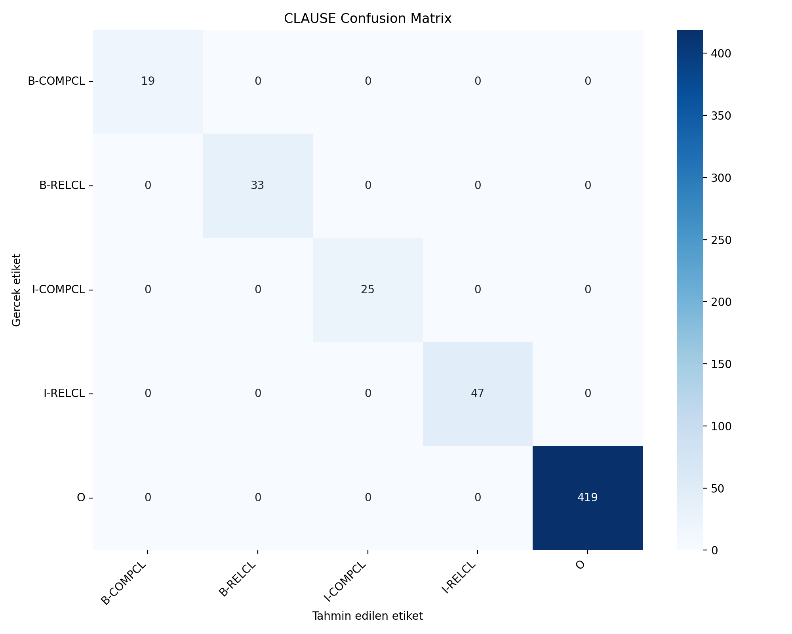

# Nested Chunking Degerlendirme Raporu

Bu rapor `python src/evaluate.py` komutu ile otomatik uretilir.
Projede istatistiksel makine ogrenmesi yontemi olarak Conditional Random Fields (CRF) kullanilmistir.

## Veri ve Isaretleme Formati

- Tum isaretlemeler CoNLL formatindadir.
- Sutunlar: `ID FORM CHUNK-OUTER CHUNK-INNER CLAUSE`.
- `B` etiketi isaretlemenin baslangicini, `I` etiketi devamini gosterir.
- `_` ic chunk bulunmadigini, `O` ilgili hedef icin disarida kalan tokeni gosterir.
- Test cumlesi sayisi: `80`.
- Test token sayisi: `543`.

## Modelleme

Ayni ozelliklerle uc ayri CRF modeli egitilmistir: `outer_model.pkl`, `inner_model.pkl` ve `clause_model.pkl`.
Boylece dis obek, ic obek ve cumlecik sinirlari birbirinden bagimsiz raporlanabilir.

## Sonuclar

Precision, recall, f-measure ve accuracy degerleri `outputs` klasorune rapor olarak kaydedilir.
Confusion matrix sonuclari PNG grafik dosyasi olarak uretilir.

### Genel Basari Ozeti

| Hedef sutun | Accuracy | Rapor dosyasi | Confusion matrix grafigi |
|---|---:|---|---|
| CHUNK-OUTER | 0.9982 | outer_classification_report.txt | outer_confusion_matrix.png |
| CHUNK-INNER | 1.0000 | inner_classification_report.txt | inner_confusion_matrix.png |
| CLAUSE | 1.0000 | clause_classification_report.txt | clause_confusion_matrix.png |

### Confusion Matrix Grafik Ozeti

Asagidaki gorsel uc hedef sutunun karisiklik matrislerini grafik olarak birlikte gosterir.



### CHUNK-OUTER

Dis obekleri gosterir. NP, VP, ADVP ve O etiketleri kullanilir.

- Accuracy: `0.9982`
- Ayrintili metin raporu: `outer_classification_report.txt`
- Confusion matrix grafigi: `outer_confusion_matrix.png`



| Sinif | Precision | Recall | F-measure | Support |
|---|---:|---:|---:|---:|
| B-ADVP | 1.0000 | 0.9828 | 0.9913 | 58 |
| B-NP | 0.9940 | 1.0000 | 0.9970 | 166 |
| B-VP | 1.0000 | 1.0000 | 1.0000 | 99 |
| I-ADVP | 1.0000 | 1.0000 | 1.0000 | 36 |
| I-NP | 1.0000 | 1.0000 | 1.0000 | 80 |
| I-VP | 1.0000 | 1.0000 | 1.0000 | 24 |
| O | 1.0000 | 1.0000 | 1.0000 | 80 |
| Macro avg | 0.9991 | 0.9975 | 0.9983 | 543 |
| Weighted avg | 0.9982 | 0.9982 | 0.9982 | 543 |

Confusion matrix sayisal tablo:

| Gercek \ Tahmin | B-ADVP | B-NP | B-VP | I-ADVP | I-NP | I-VP | O |
|---|---:|---:|---:|---:|---:|---:|---:|
| B-ADVP | 57 | 1 | 0 | 0 | 0 | 0 | 0 |
| B-NP | 0 | 166 | 0 | 0 | 0 | 0 | 0 |
| B-VP | 0 | 0 | 99 | 0 | 0 | 0 | 0 |
| I-ADVP | 0 | 0 | 0 | 36 | 0 | 0 | 0 |
| I-NP | 0 | 0 | 0 | 0 | 80 | 0 | 0 |
| I-VP | 0 | 0 | 0 | 0 | 0 | 24 | 0 |
| O | 0 | 0 | 0 | 0 | 0 | 0 | 80 |

### CHUNK-INNER

Dis obek icindeki ic yapilari gosterir. Bu projede RELCL ve bos ic obek icin _ kullanilir.

- Accuracy: `1.0000`
- Ayrintili metin raporu: `inner_classification_report.txt`
- Confusion matrix grafigi: `inner_confusion_matrix.png`



| Sinif | Precision | Recall | F-measure | Support |
|---|---:|---:|---:|---:|
| B-RELCL | 1.0000 | 1.0000 | 1.0000 | 33 |
| I-RELCL | 1.0000 | 1.0000 | 1.0000 | 47 |
| _ | 1.0000 | 1.0000 | 1.0000 | 463 |
| Macro avg | 1.0000 | 1.0000 | 1.0000 | 543 |
| Weighted avg | 1.0000 | 1.0000 | 1.0000 | 543 |

Confusion matrix sayisal tablo:

| Gercek \ Tahmin | B-RELCL | I-RELCL | _ |
|---|---:|---:|---:|
| B-RELCL | 33 | 0 | 0 |
| I-RELCL | 0 | 47 | 0 |
| _ | 0 | 0 | 463 |

### CLAUSE

Cumlecikleri gosterir. RELCL, COMPCL ve cumlecik disi O etiketleri kullanilir.

- Accuracy: `1.0000`
- Ayrintili metin raporu: `clause_classification_report.txt`
- Confusion matrix grafigi: `clause_confusion_matrix.png`



| Sinif | Precision | Recall | F-measure | Support |
|---|---:|---:|---:|---:|
| B-COMPCL | 1.0000 | 1.0000 | 1.0000 | 19 |
| B-RELCL | 1.0000 | 1.0000 | 1.0000 | 33 |
| I-COMPCL | 1.0000 | 1.0000 | 1.0000 | 25 |
| I-RELCL | 1.0000 | 1.0000 | 1.0000 | 47 |
| O | 1.0000 | 1.0000 | 1.0000 | 419 |
| Macro avg | 1.0000 | 1.0000 | 1.0000 | 543 |
| Weighted avg | 1.0000 | 1.0000 | 1.0000 | 543 |

Confusion matrix sayisal tablo:

| Gercek \ Tahmin | B-COMPCL | B-RELCL | I-COMPCL | I-RELCL | O |
|---|---:|---:|---:|---:|---:|
| B-COMPCL | 19 | 0 | 0 | 0 | 0 |
| B-RELCL | 0 | 33 | 0 | 0 | 0 |
| I-COMPCL | 0 | 0 | 25 | 0 | 0 |
| I-RELCL | 0 | 0 | 0 | 47 | 0 |
| O | 0 | 0 | 0 | 0 | 419 |

## Tahmin Dosyasi

`nested_predictions.conll` dosyasinda her token icin altin ve tahmin edilen etiketler birlikte verilir:

```text
ID FORM GOLD_OUTER PRED_OUTER GOLD_INNER PRED_INNER GOLD_CLAUSE PRED_CLAUSE
```
